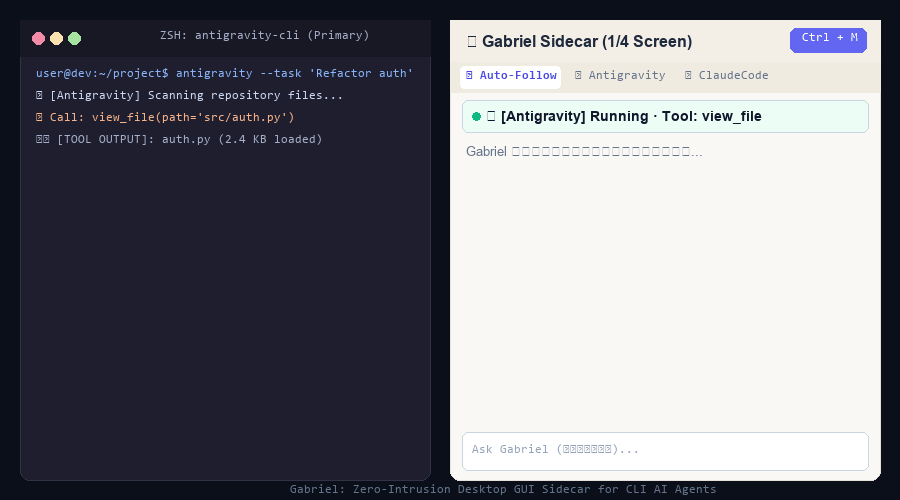

<p align="center">
  
</p>

<h1 align="center">Gabriel 👼 (加百列)</h1>

<p align="center">
  <strong>专为 CLI AI Agent 设计的桌面零侵入 GUI 智慧副屏与战术副脑</strong><br>
  <em>“主线不打断，支线不迷失。”</em>
</p>

<p align="center">
  <a href="README.md">English Documentation</a> •
  <a href="#-快速上手">🚀 快速上手</a> •
  <a href="#-核心亮点">✨ 核心亮点</a> •
  <a href="#-开发初衷与起源故事">💡 起源故事</a> •
  <a href="docs/LAUNCH_KIT.md">📢 宣发物料包</a>
</p>

<p align="center">
  <a href="LICENSE"></a>
  <a href="pyproject.toml"></a>
  <a href="tests/test_gabriel.py"></a>
  <a href="pyproject.toml"></a>
  
</p>

<p align="center">
  
</p>

---

## 💡 开发初衷与起源故事 (Origin Story)

加百列（Gabriel）最初的构想，并非来自抽象的技术推演，而是源于我个人在日常学习中切身经历的真实痛点：

> 📖 **雅思备考与认知双轨困境**：  
> 当时我用 **Gemini 3.1 Pro** 辅助备考雅思，工作流是每天练习句子与词汇升阶。在批改作文和句式时，Gemini 默认我理解所有复杂的生僻词与语法结构，直接给出高维度的评价。  
> 当时我有许多单词和句式并不理解，但我**不敢在主对话里直接打断问它** —— 因为一旦问了基础单词，Gemini 就会跑偏去讲词根词缀，**打碎原本连贯的做题心流，还严重污染了上下文记忆**；  
> 如果我切到浏览器去搜索，又会被各种杂乱的网页广告打断注意力，检索效率极低。

当自主编程 Agent（**Claude Code、Antigravity、Cursor、Aider、OpenHands**）在终端里爆发时，我意识到**全世界的开发者在面对 CLI Agent 时，每天都在承受完全相同的“双轨认知割裂”**：

```
主线执行终端 (Primary Terminal)         加百列战术副屏 (Gabriel Sidecar)
┌────────────────────────────────┐     ┌────────────────────────────────┐
│ Claude / Antigravity Agent     │     │ 1/4 屏幕无干扰副屏              │
│ 正在执行长达 20 分钟的自主重构...│ ──> │ 本地静默旁路日志监听             │
│                                │     │                                │
│ 💥 抛出异常 / 500 / Traceback  │ ──> │ 🔴 状态脉冲红灯预警             │
│                                │     │ 📌 一键快照投喂副脑             │
│ [主终端长任务丝毫不受干扰]      │     │ 💡 独立副脑推演："帮我分析这行报错"│
└────────────────────────────────┘     └────────────────────────────────┘
```

* 主 Agent 在终端里跑 20 分钟的长任务，**你根本不敢在终端里插话提问**，生怕打乱执行链路、污染宝贵的 Context Window；
* 终端日志动辄几百行 Tool Call 呼啸刷屏，**肉眼翻找报错极其痛苦**；
* 终端会话一关闭，**刚才几十万 Token 踩坑沉淀的宝贵经验瞬间烟消云散**。

**加百列就是为了彻底解决这一困境而打造的 1/4 屏桌面零侵入副屏。** 它在后台静默监听本地 Agent 轨迹，提供物理隔离的独立副脑问答沙盒、余光可及的状态看板，以及会话终结后的经验沉淀。

---

## ✨ 核心亮点

### 1. 🟢 极简态势感知看板 & 智能折叠日志
* **Mini Status 状态栏**：余光一瞥即可掌握 Agent 当前状态（`🟢 运行中` / `🟡 思考中` / `🔴 捕获异常`）与执行步数。
* **智能可折叠日志（`<details class="log-fold">`）**：对冗长的大段 Tool Output 默认收拢为单行摘要（`▶ 🛠️ [Tool Output] (240 chars)`），遇到报错自动展开并高亮红框。

### 2. 📌 零摩擦一键报错快照挂载
* 终端报错时，只需在副屏点击 **`📌 引用最新报错`** 或 **`⚡ 挂载当前步骤`**。
* 加百列秒级截取错误切片，挂载至输入框，调用副脑模型（如 DeepSeek、GPT-4o-mini 或本地 Ollama）快速推演方案，**绝不触碰和污染主终端**。

### 3. 📊 会话终结复盘战报与 Token 账单 (`/digest`)
* 在副脑输入 `/digest` 或点击 **`📊 复盘战报`**，自动生成专业级 Markdown 复盘总结：
  * 🎯 **核心目标与最终达成状态**
  * 🛠️ **关键执行链路与触及文件列表**
  * ⚠️ **踩坑卡点与根本原因分析**
  * 💰 **Token 消耗估算与成本账单**
  * 💾 **一键沉淀避坑指南至本地知识库** (`knowledge.db`)

### 4. 🚢 多 Agent 舰队标签栏 (Fleet Tab Bar)
* 同时并发跑多个终端 Agent？加百列顶部的 Linear 风格标签栏自动聚合并跟踪所有活跃会话：
  * `⚡ Auto-Follow`（自动跟随最新产生活动的终端）
  * `[🟢 Antigravity]` `[🟣 Claude Code]` `[⚡ Aider]` `[🤖 OpenHands]` `[✨ Gemini CLI]`
  * 点击任意标签一键切屏并锁定监听。

### 5. 📐 灵动胶囊模式 (`Ctrl + M`)
* 一键将 1/4 屏幕收缩为屏幕边缘 **36px 极简悬浮药丸**。
* 平时不占视线，仅在需要时通过脉冲灯低调提示。

### 6. 🧠 双重 RRF 混合知识库 (FTS5 + sqlite-vec)
* 内置 `sqlite-vec` 向量语义检索 + `jieba` 中文全文搜索，通过倒数排名融合 (RRF) 算法合并。
* 当历史同类报错再次出现时，主动弹出历史解决方案。

### 7. 🛡️ 100% 纯本地 · 零 CDN
* 严格遵循无外网 CDN 依赖设计（本地内置字体、本地 Marked.js、Highlight.js、DOMPurify）。
* 严苛的安全 CSP 策略与随机 Token 鉴权。

---

## 🚀 快速上手

### 方式一：Windows 绿色免安装版（推荐，无需 Python 环境）
1. 前往 [GitHub Releases](https://github.com/3ZEROS12/Gabriel/releases) 下载 `Gabriel-v4.0.0-Windows.zip`；
2. 解压后双击 `Gabriel.exe` 即可直接运行！

---

### 方式二：源码运行 (Python 3.10+)

```bash
# 1. 克隆仓库
git clone https://github.com/3ZEROS12/Gabriel.git
cd Gabriel

# 2. 创建并激活虚拟环境
python -m venv venv
venv\Scripts\activate          # Windows
# source venv/bin/activate    # macOS / Linux

# 3. 安装依赖
pip install -r requirements.txt
pip install -e .              # 可选：全局注册 gabriel CLI

# 4. 启动加百列
gabriel                        # 或 python -m src.main --port 8080
```

* **桌面端模式**：运行 `python src/run.py`，将在原生独立桌面窗口中唤起加百列；
* **浏览器模式**：打开 `http://127.0.0.1:8080`，输入终端打印的安全 Token 即可登录。

---

## 🔌 支持的 CLI Agent 生态

加百列通过静默 Tail 本地日志运行，无需在 Agent 中安装任何插件或配置代理：

| 智能体 (Agent) | 监听的本地轨迹日志 | 解析器引擎 |
| :--- | :--- | :--- |
| **Antigravity** | `~/.gemini/antigravity-cli/brain/*/logs/*.jsonl` | `AntigravityParser` |
| **Claude Code** | `~/.claude/projects/*/*.jsonl`, `~/.claude/logs/*.jsonl` | `ClaudeCodeParser` |
| **Cursor CLI** | `~/.cursor/logs/*.log`, `~/.config/Cursor/logs/*.log` | `CursorParser` |
| **Aider** | `.aider.chat.history.md`, `.aider.input.history` | `AiderParser` |
| **OpenHands** | `~/.openhands/logs/*.jsonl`, `~/.openhands/sessions/*/*.jsonl` | `OpenHandsParser` |
| **Gemini CLI** | `~/.gemini/logs/*.jsonl`, `~/.gemini/transcripts/*.jsonl` | `GeminiCLIParser` |
| **标准纯文本日志** | 任何标准 stdout/stderr 文本日志 | `PlainTextFallbackParser` |

---

## ⌨️ 快捷键指南

| 快捷键 | 功能描述 |
| :--- | :--- |
| `Ctrl + M` | 切换 36px 灵动胶囊模式 / 1/4 完整副屏 |
| `Ctrl + [` | 折叠 / 展开左侧导航栏 (56px) |
| `Ctrl + B` | 折叠 / 展开终端监视卡片面板 |
| `Ctrl + Enter` | 发送副脑问答消息 |
| `/digest` 或 `/d` | 秒级生成本次长任务复盘战报与账单 |
| `/clear` | 清空当前副脑对话记录 |
| `/help` | 打开快捷键与使用指引弹窗 |

---

## 🛡️ 质量保证与测试矩阵

```bash
# 运行 39 项自动化单元与集成测试
pytest tests/ -q

# 代码规范静态检查
ruff check src tests

# 前端零 CDN 静态语法校验
node --check static/script.js static/icons.js
```

---

## 📄 开源许可证

本项目采用 [AGPL-3.0 许可证](LICENSE) 开源。
