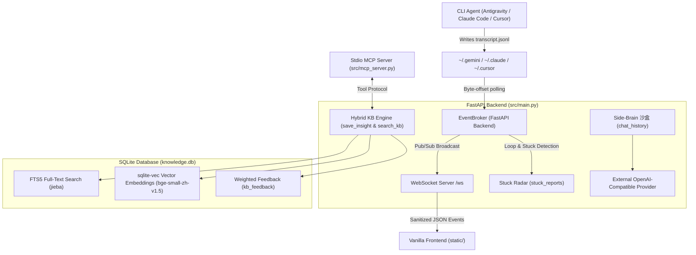

# Gabriel Architecture & System Design

Gabriel is designed as a **Zero-Intrusion GUI Sidecar** for CLI-based AI agents (Antigravity, Claude Code, Cursor). It operates strictly out-of-band using filesystem tailing, WebSocket event broadcasting, and local SQLite persistence.

---

## 🏗️ Core Architectural Layers

---

## 🧩 Key Components

### 1. Zero-Intrusion Tailing (`EventBroker`)
- **No Hooks / No PTY**: Gabriel polls transcript log files via byte-offset incremental reads. It never hooks into `stdout`, `pty`, or terminal APIs.
- **Fail-Safe**: If Gabriel or its backend crashes, the CLI Agent continues uninterrupted. If the CLI Agent crashes, Gabriel logs the final stack trace safely.
- **Bounded Queues**: WebSockets use non-blocking bounded queues (`asyncio.Queue(maxsize=100)`). Slow browser clients drop frames instead of stalling backend I/O.

### 2. Hybrid RRF Knowledge Base Engine
- **FTS5 + Vector Fusion**: Uses `jieba` tokenization for SQLite FTS5 keyword matching and `sqlite-vec` + `fastembed` (`BAAI/bge-small-zh-v1.5`) for local dense vector search.
- **Reciprocal Rank Fusion (RRF)**: Merges sparse and dense search scores cleanly without manual score normalization.
- **Graceful Fallback**: If `sqlite-vec` or embedding models are unavailable, the search pipeline seamlessly degrades to pure FTS5 keyword matching.
- **Single-Source Single-Path**: All writes route through `save_insight()`, and all searches route through `search_kb()`.

### 3. Side-Brain Chat & Snapshot Sandbox
- **Context Isolation**: Chat queries to the side-brain AI use terminal snapshot attachments without injecting into or polluting the primary CLI Agent's memory.
- **SQLite Persistence**: Chat history is persisted per agent session in the `chat_history` table (capped at 40 turns).

### 4. Stuck Radar & Tool Oscillation Detection
- **Sliding Window Signature**: Monitors tool execution signatures (`_tool_signature`) in real time to detect loop oscillations.
- **Stuck Reports Table**: Traps repeated errors in `stuck_reports` and queries past solution insights automatically via `search_kb()`.

### 5. Stdio MCP Server (`src/mcp_server.py`)
- Exposes 4 MCP tools (`read_gabriel_kb`, `add_gabriel_insight`, `report_agent_stuck`, `get_session_summary`) over standard I/O (stdio) or HTTP, allowing external LLM CLI tools to query Gabriel's local SQLite store.

### 6. Light Indigo Frontend Design (`static/`)
- **Zero CDN Dependencies**: All assets (Inter/JetBrains Mono woff2 fonts, Lucide SVG icons, marked, DOMPurify, highlight.js) are vendored locally in `static/vendor/`.
- **XSS Protection**: All incoming markdown and dynamic string rendering is sanitized via `DOMPurify.sanitize()` before touching `innerHTML`.
- **CSS Tokenization**: Color hex tokens are strictly scoped to `:root` and `.log-*` classes in `style.css`.

---

## 🔒 Security Model

- **Token Guard**: All HTTP routes require `X-Gabriel-Token` (compared in constant time via `secrets.compare_digest`).
- **Ticket Handshake**: WebSocket connections use single-use authentication tickets (`POST /api/auth/ticket`, 5-minute TTL) to avoid leaking tokens in WebSocket URLs.
- **Local First**: No remote telemetry or cloud calls. API keys exist strictly in memory or `.env` and are never exposed via config endpoints.
