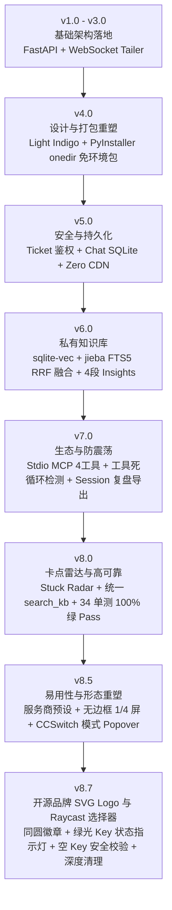

# Gabriel 开发全景图与路线图 (Master Development Roadmap)

> **文档定位**：本文件为 Gabriel（加百列）项目的全局开发历程、核心架构设计、版本演进以及后续重启开发的唯一索引与路线图指南。

---

## Ⅰ. 项目定位与起步初衷 (Vision & Lore)

### 1. 起步初衷与个人定位
Gabriel 最初是开发者为解决**个人自用痛点**而打造的 Agent 旁路副屏工具：
- **开发起步点**：每当主 CLI Agent（Antigravity / Claude Code / Cursor）在终端中执行一项复杂的**长任务**时，开发者往往会产生很多发散性的探索问题，但**完全不敢打扰或随便提问** —— 生怕打断主 Agent 的思考上下文链路、污染记忆记忆库，或让其在主干任务中做无用功。
- **解决方案**：Gabriel 作为**零侵入的旁路副屏 (Sidecar)**，静默监控 Agent 日志，提供隔离的“副脑问答沙盒”与“可视化控制台”，让用户在主 Agent 跑长任务时可以随时向副屏 Ask / Debug，完全不打扰主 Agent 记忆。

### 2. 核心机制
- **旁路 Tail**：静默监控已知 Agent 轨迹日志（如 `~/.gemini/antigravity-cli/brain/**/logs/transcript.jsonl`），增量字节偏移读取。
- **物理安全**：无 PTY / STDOUT / 终端 Hook，绝不会阻塞或导致主 Agent 崩溃。
- **副脑隔离问答**：允许开发者随时向副屏 Ask/Debug，不占用、污染主 Agent 的上下文记忆。
- **私有知识库注入**：将副脑调试得出的经验 / 踩坑点，一键结构化存入知识库，并可通过 MCP / 剪贴板注入会话。

### 2. 命名与世界观设定 (Lore)
> “加百列，神之力与智慧之使者 —— 手持白百合，为战场上的米迦勒带来破局启示。”  
在加百列的世界观设定中：
- **主 CLI Agent（Antigravity / Claude Code）** 充当 **米迦勒（Michael - 主战大统帅）**，在终端主战场上正面硬刚 Bug 与复杂长任务；
- **Gabriel 旁路副屏** 则是 **加百列（Gabriel - 智慧使者）**，手持白百合与纯净上下文，在旁路静默守护，当主 Agent 遭遇卡点或死循环时递上神圣解法与破局 Insight。

---

## Ⅱ. 演进历程与版本里程碑 (Development Trajectory)

Gabriel 经历了从简单日志 Tail 界面，到具备双重 RRF 知识库、MCP 工具链、桌面免环境发行版以及 Stripe 风格视觉的完整演进：



### 详细版本履历

#### 1. v1.0 ~ v3.0 (基础架构构建)
- 建立基于 FastAPI 的 REST + WebSocket 日志广播服务。
- 智能识别 Antigravity / Claude Code / Cursor 的 `transcript.jsonl` 日志结构。
- 提供多卡片并行监控与静态文件服务。

#### 2. v4.0 (设计重塑与 Windows 免环境打包发行)
- **浅色单主题（Stripe 精致感）**：基于 [`DESIGN.md`](file:///C:/Users/Jason/Desktop/Gabriel/DESIGN.md) 实现纯净白底 (`#ffffff`) + 藏青 (`#0d253d`) + 靛紫 (`#533afd`) 唯一 CTA 视觉规范。
- **PyInstaller 免环境发行**：使用 `PyInstaller Gabriel.spec` 打包为 `onedir` 绿色包 (`Gabriel-v4.0.0-win64.zip` ~113MB)。
- **数据/代码分离**：解压运行模式下 `DATA_DIR` 自动落入 exe 同级目录，static 资源打包于 `_MEIPASS`。
- **单实例锁与端口自适应**：`.gabriel.lock` 单实例保护，8080 端口被占自动递增重试。

#### 3. v5.0 (安全与持久化增强)
- **鉴权安全收拢**：所有 `/api/*` 端点基于 `X-Gabriel-Token` 验证；引入 `/api/auth/ticket` 一次性 Ticket 握手，避免 WebSocket URL 泄露 Token。
- **Side-brain 聊天持久化**：建立 SQLite `chat_history` 表，单 Agent 保留 40 轮问答，服务重启不丢失。
- **零 CDN 纯离线**：字体（Inter 300/400/500, JetBrains Mono 400/600 woff2）、Icons (Lucide SVG)、JS 库（marked, DOMPurify, highlight.js）全量 Vendor 进 `static/vendor/`。

#### 4. v6.0 (混合检索与 4 段结构化知识库)
- **向量 + 全文 RRF 混合检索**：结合 `sqlite-vec` + `fastembed` (`BAAI/bge-small-zh-v1.5`) 向量语义检索与 `jieba` 中文分词 FTS5 全文检索，采用倒数排名融合 (RRF) 算法。
- **优雅降级**：模型 / 向量库不可用时静默回退纯 FTS5 模式。
- **4 段结构化 Insight**：输入输出统一结构化为 `{problem, cause, solution, tags}`，支持 Tag Chips 渲染。
- **Tenacity 重试**：API 连接与大模型请求配置指数退避重试（防御 429/500/Timeout）。
- **标准测试集**：引入 `pytest` 单元测试与 `ruff` 代码检查。

#### 5. v7.0 (MCP 工具链与死循环检测)
- **Stdio MCP 服务**：[`src/mcp_server.py`](file:///C:/Users/Jason/Desktop/Gabriel/src/mcp_server.py) 提供 `read_gabriel_kb` / `add_gabriel_insight` / `report_agent_stuck` / `get_session_summary` 4 大工具。
- **工具死循环/震荡检测**：通过滑动窗口算法识别频繁调用的重复工具签名，自动触发预警。
- **统一写入入口**：收敛所有 KB 写入方法为单一函数 `save_insight()`。
- **Session 复盘 Markdown 导出**：支持导出包含 Character/Token 统计、触及文件列表及完整日志的 Markdown 报告。

#### 6. v8.0 (卡点雷达、统一检索管道与稳定性验收)
- **卡点雷达 (Stuck Radar)**：建立 `stuck_reports` 表，配合 MCP 自动抓取 Agent 报错并提供 KB 一键解法匹配。
- **统一检索管道**：收敛所有 KB 查询为单一函数 `search_kb()`，统一反馈重排逻辑。
- **自动化稳定性与断言**：提供 `scripts/stability_run.py` 进行长跑内存泄漏断言。
- **全量测试与规范 100% 绿灯**：34/34 pytest 单元测试通过，`ruff check` 0 警告，前端 JS `node --check` 语法纯净。

#### 7. v8.6 (多服务商 Key 记忆、动态模型拉取与开源 Benchmark)
- **开源对比全局命令**：将“持续联网参考开源优质项目（Cherry Studio / LobeChat / NextChat）”写入全局开发守则。
- **多服务商 Key 独立持久化**：建立 SQLite `provider_configs` 表，每个服务商（DeepSeek、OpenAI、硅基流动、智谱等）独立记忆其 Base URL、API Key、Model Name 与计费单价，切换服务商瞬间自动还原 Key。
- **动态模型获取端点**：提供 `POST /api/config/models`，自动请求供应商 `/v1/models` 端点并实时构建可用模型下拉菜单。
- **高级配置折叠收纳**：手填 Token 价格字段收纳至 `<details>` 面板，去除主视图打扰。

#### 8. v8.7 (正版开源 SVG Logo、Raycast 胶囊选择器与测试全绿)
- **10 大厂商正版开源矢量 SVG Logo**：挂载 SimpleIcons / LobeHub 官方开源矢量 Logo（OpenAI, DeepSeek, Claude, Gemini, SiliconFlow, Zhipu, Qwen, Kimi, Ollama, Groq）。
- **Raycast / Linear 极简同圆徽章选择器**：采用 24px 微型同圆徽章与圆角胶囊 Pill 造型，兼具高级感与规范排版。
- **🟢 绿光 Key 状态指示灯与 🔑 全局计数器**：无需点击即可直观洞察哪些厂商已配置 API Key 及全局已配置总数。
- **一键清空 Key (`✕`) 与安全校验拦截**：支持聚焦自动高亮与一键清空 Key；连接测试去除了环境 Key 静默回退，空 Key 请求精准返回 400 校验拦截提示。
- **仓库深度清理**：全量清除开发过程生成的 49 个临时碎片文件与 10 个测试过程目录，测试集 34/34 持续 100% 全绿。

---

## Ⅲ. 核心架构与工程守则 (Architecture & Guardrails)

### 1. 代码库结构
```
Gabriel/
├── src/
│   ├── main.py            # FastAPI 后端: REST API + WebSocket + 日志 Tailer + FTS5/向量 KB + 多服务商持久化
│   ├── mcp_server.py      # Stdio MCP 服务 (供 External Agent 调用)
│   └── run.py             # pywebview 桌面包装壳 (1/4 屏幕无边框形态)
├── static/
│   ├── index.html         # Dashboard 页面 (4 大视图 + Token 登录)
│   ├── script.js          # 前端交互逻辑 (i18n、WS、模式 Popover、动态模型拉取)
│   ├── style.css          # v4 Light Indigo 样式系统
│   ├── icons.js           # Lucide 图标模块
│   └── vendor/            # 本地 Vendor 字体与 JS 依赖 (零 CDN)
├── docs/
│   ├── ARCHITECTURE.md    # 系统架构设计
│   ├── API_REFERENCE.md   # API 端点参考
│   ├── AUTOSTART.md       # Windows 开机自启配置
│   ├── RELEASE.md         # 打包发布指南
│   ├── LICENSE_RATIONALE.md # GPL 许可证说明
│   └── DEVELOPMENT_ROADMAP.md # 本文件 (全景开发路线图)
└── tests/
    └── test_gabriel.py    # Pytest 自动化测试集
```

### 2. 绝对不可逾越的开发守则
1. **零 CDN 依赖**：绝不从外部 CDN 动态加载 CSS/JS/字体，保证 100% 离线可用。
2. **颜色 Token 规范**：十六进制颜色值只能存在于 `style.css` 的 `:root` 与 `.log-*` 映射区；HTML/JS 严禁内联 style 硬编码颜色。
3. **KB 写入与检索单一入口**：写入强制走 `save_insight()`，检索强制走 `search_kb()`，禁止手写平行 SQL 逻辑。
4. **离线降级策略**：向量库缺失或 LLM 连接失败时必须无缝平滑降级至本地 FTS5，严禁抛错阻塞主流程。
5. **变动必须通过验证**：修改后必须确保 `pytest tests/` (34 个测试)、`ruff check` 和 `node --check` 全绿。
6. **开源对比全局指令**：优化时必须一直联网参考开源优质项目（Cherry Studio, LobeChat, NextChat, One-API）的设计规范与技术最佳实践。

---

## Ⅳ. 后续重启开发路线图 (Future Roadmap When Resuming)

根据开源标杆项目深度对比，后续开发建议按以下优先级逐步推进：

### 阶段 1：高可用路由与 Token 观测性 (P0 - 近期可落地)
- **模型自动故障转移路由 (Model Fallback Router)**：参考 One-API 机制，当主模型 API 遭遇 503 繁忙或 429 限流时，自动无缝透明降级至备用服务商/模型，确保副驾永不卡死。
- **Context Token 实时占用条 (Context Gauge Bar)**：在 Chat 窗口顶部显示当前对话上下文的 Token 占用百分比（如 `8,420 / 128,000 Tokens (6.5%)`）与消耗预估。

### 阶段 2：交互体验与系统级支持 (P1 - 体验突破)
- **全局唤醒热键 (Global Shortcut Hotkey)**：支持 `Alt + G` 系统级快捷键，在 Windows 上任意应用下无缝呼出/隐藏 Gabriel 窗口。
- **终端日志智能分流 (Interactive Log Search)**：在 Terminal Context 面板增加 `🔴 仅看报错`、`🛠️ 仅看工具` 选项卡，助用户秒定位卡点。
- **Mermaid 图表与 Code Diff 渲染**：支持解析展示 Mermaid 架构流程图与 `git diff` 格式补丁对比。

### 阶段 3：生态扩展与副脑 MCP (P2 - 长期演进)
- **副脑自用 MCP 工具箱 (Side-Brain MCP Client)**：允许 Gabriel 副脑调用外部 MCP 工具（如 Brave Web 搜索API、本地文件检索），提升调试与答疑能力。
- **快捷指令库 (Slash Commands)**：提供 `/debug`、`/review` 等常用高频 Prompt 模版快捷触发。

---

*(文档更新时间：2026-08-11 | 校验状态：代码库 34/34 测试通过)*
